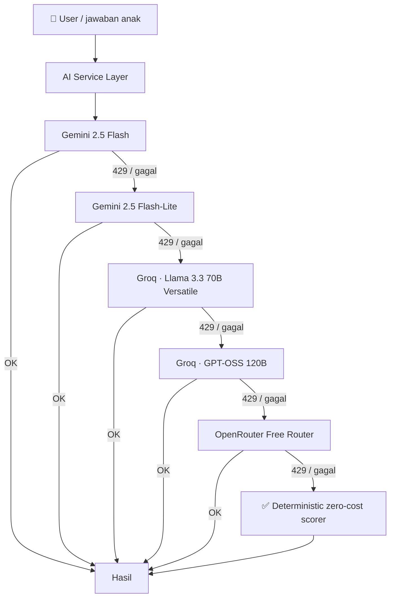

# First Placement Test — Riset & Rekomendasi Desain

Status: **Riset selesai, sebagian besar sudah diimplementasi** per 2026-08-20 — lihat [§12](#12-update-pasca-riset--keputusan-dikonfirmasi--diimplementasikan-2026-08-20) untuk apa yang benar-benar dibangun (§1–§11 di bawah tetap dokumen riset aslinya, dipertahankan apa adanya sebagai rationale).
Terakhir diupdate: 2026-08-20

> Dokumen ini **tidak mengubah kode apa pun**. Isinya: survei praktik institusi (dalam & luar negeri), rekomendasi struktur test per skill, resolusi ketegangan "replay mengurangi poin" vs prinsip non-punitive yang sudah dikunci, rekomendasi durasi, dan peta teknologi yang bisa dipakai **tanpa biaya tambahan**.
>
> Konteks wajib dibaca dulu: [CLAUDE.md](../CLAUDE.md) (filter kid-friendly), [PRD.md](../PRD.md) §4.5/§4.6 (non-punitive), §5 (tanpa backend/AI API di v1), §14 (placement test yang sudah ada), [RESEARCH.md](../RESEARCH.md) §15–§16.

---

> ## 🔒 Pengingat: Filter Kid-Friendly Berlaku Penuh di Dokumen Ini
>
> Semua referensi di bawah — Cambridge, ETS/TOEFL, EF SET, Duolingo, Cakap, Novakid, ELSA, Buddy.ai — **tidak satu pun dibuat dengan filosofi produk kita**. Semuanya adalah test formal/komersial dengan skor, sebagian bertimer, sebagian sengaja "tidak boleh diulang". Yang boleh diambil dari mereka adalah **struktur & mekanik** (urutan skill, format soal, logika adaptif, panjang audio). Yang **tidak** boleh ikut terbawa: nada evaluatif, timer, status gagal, dan skor sebagai hukuman (CLAUDE.md poin 2 & 4, PRD §4.5/§4.6).
>
> Setiap rekomendasi di dokumen ini sudah dilewatkan filter itu; di tempat yang tegangannya nyata (§5 soal replay), ketegangannya **ditulis terbuka**, bukan diselesaikan diam-diam.

---

## 1. Ringkasan (TL;DR)

Untuk implementer yang cuma sempat baca satu bagian:

- **Durasi target: 8–12 menit, cap keras ~15 menit**, dipecah jadi **4 ronde pendek 2–3 menit** (1 ronde = 1 skill), dengan perayaan kecil di antara ronde. Bukan 1 blok panjang. Copy "⏱️ Sekitar 15 menit" yang sekarang hardcoded di `app/src/games/placement.ts:46` **tidak akurat** untuk implementasi hari ini (9 soal tap ≈ 1–2 menit) dan sebaiknya diubah jadi "sekitar 10 menit" begitu struktur 4-skill benar-benar dibangun. Detail: §6.
- **Struktur 4 skill nyata, bukan label**: Vocab (tap emoji — sudah ada), Grammar (susun chip kalimat — reuse `games/grammar.ts`), Listening (**cerita mini 2–3 kalimat → 1 pertanyaan** — mekaniknya SUDAH ADA di `games/listening.ts:runTantangan` + `speakSequence()`), Speaking (2 lapis: item **pilihan-ganda berbasis dengar** yang di-skor + mic terbuka yang **tidak** di-skor). Detail: §4.
- **Adaptif ringan (CAT/IRT sederhana) ditulis tangan di TypeScript** menggantikan tangga 9 soal tetap — benar → naik sulit, salah → turun; berhenti saat estimasi level stabil atau kuota soal habis. Ini persis yang Cambridge & Duolingo lakukan di balik layar, dan **nol biaya** (tidak butuh engine CAT komersial). Detail: §4.5.
- **Replay: JANGAN mengurangi poin.** Tidak ada satu pun institusi arus utama yang memotong poin karena anak mengulang audio — Cambridge YLE & CEPT justru **memutar setiap rekaman dua kali secara default**, EF SET mengizinkan 2x tanpa penalti, ujian dewasa formal memilih 0x replay (tapi tetap tanpa penalti). Rekomendasi: replay & perlambat **gratis dan tak terbatas**, jumlah replay disimpan sebagai **sinyal kalibrasi internal** (tie-breaker di algoritma adaptif, tidak pernah ditampilkan sebagai pengurangan nilai ke anak). Ini menyimpang dari permintaan literal user — **butuh konfirmasi user sebelum diimplementasi**. Detail: §5.
- **Teknologi v1 = 100% browser-native, nol biaya marginal**: `speechSynthesis` (TTS) + `SpeechRecognition` (STT) yang **sudah** dipakai di `app/src/speech.ts`, ditambah peluang gratis yang **belum** dipakai (`confidence`, `maxAlternatives`, Web Audio `AnalyserNode`, Levenshtein/Metaphone murni JS, MediaRecorder, IndexedDB, Service Worker/PWA). Detail: §7.
- **Default suara sudah sesuai permintaan user** dan terverifikasi di kode: `selectedGender = 'female'`, `selectedAccent = 'us'`, `playbackRate = 0.9` (`app/src/speech.ts:11–14`). Tiga celah kecil ditemukan: (a) panel kecepatan **tidak dipasang** di layar placement test, jadi anak belum bisa memperlambat di situ; (b) `0.9` tidak ada di `SPEEDS = [0.5, 0.75, 1, 1.25, 1.5]` sehingga tidak ada pill yang aktif saat pertama buka; (c) pilihan suara/kecepatan tidak disimpan, reset tiap reload. Detail: §7.7.
- **LLM gratis = Iterasi 2, BUKAN v1 — dipisah total di §8.** Memakai LLM API apa pun — termasuk yang gratis (Gemini free tier, Groq free plan, OpenRouter `:free`) — **bertabrakan langsung** dengan keputusan terkunci PRD §5/CLAUDE.md ("tanpa ... AI API di v1"). §8 berisi rancangan **siap-bangun** (tabel prioritas 8 model, rate limit tiap penyedia, dan fallback chain lintas-penyedia Gemini → Groq → OpenRouter → penilai deterministik) **untuk saat keputusan PRD §5 ditinjau ulang** — bukan rekomendasi yang sedang diajukan. Baca §7 dan §8 sebagai dua jalur terpisah: **v1 = nol biaya, browser-native, tanpa LLM**; **iterasi 2 = lapis LLM opsional di atasnya**.

---

## 2. Kondisi Hari Ini — Baseline Kode Nyata

Semua di bawah ini dibaca langsung dari kode, bukan asumsi.

### 2.1 Yang sudah ada

| Berkas | Isi |
|---|---|
| `app/src/games/placement.ts` | Intro ("First Placement Test"), 9 soal, layar hasil, skip |
| `app/src/placement-test-data.ts` | 9 soal: 3 `starter`, 3 `explorer`, 3 `adventurer` — semua bentuknya `{ word, options: [emoji × 4] }` |
| `portal/lib/placement-scoring.ts` | Re-scoring di server: mastery/ceiling, `THRESHOLD = 2` benar per band, naik selama threshold terpenuhi, **berhenti di kegagalan pertama** |
| `app/src/speech.ts` | TTS/STT Web Speech API, `SPEEDS`, `speakSequence()`, `normalize()`, `looseMatch()` |
| `app/src/games/listening.ts` | `runTantangan()` — **"Dengar Cerita Mini" → 1 pertanyaan → tap emoji**. Ini persis pola yang user minta untuk listening section |
| `app/src/games/speaking.ts` | `runLatihanInti()` — mic + `looseMatch()`; `runTantangan()` — mini-roleplay yang **selalu** dianggap berhasil |
| `app/src/games/grammar.ts` | `runLatihanInti()` — Susun Kalimat dari chip; `runTantangan()` — "Bikin Sendiri" (pilih kata) |
| `app/src/voice-panel.ts` | Panel kecepatan + gender + aksen, dipasang di layar **aktivitas** (`app.ts:736`) & **pengaturan** (`app.ts:896`) |

### 2.2 Celah yang harus diakui jujur

1. **Framing "4 skill" belum sesuai kenyataan.** Intro menampilkan 4 pill (📚 Vocab / ✏️ Grammar / 🎧 Listening / 🗣️ Speaking), tapi 9 soalnya **semua** bermekanik sama: TTS ucapkan 1 kata → tap emoji. Ini vocab-recognition murni. Kode sendiri sudah jujur soal ini (komentar di `placement.ts:21–24`), tapi anak/orang tua yang membaca intro akan mengira ada 4 jenis kegiatan. **Rekomendasi §4 menutup celah ini dengan menambah mekanik nyata, bukan mengganti label.**
2. **Klaim durasi tidak akurat.** `"⏱️ Sekitar 15 menit"` (`placement.ts:46`) vs realita 9 tap tanpa timer ≈ 1–2 menit. Angka ini tampaknya diwarisi dari placement test versi dewasa (30 menit) yang dipangkas kira-kira, bukan diukur.
3. **Tidak ada jalan untuk "minta diperlambat" di layar placement test.** `renderVoicePanel()` tidak dipanggil di `renderPlacementTestScreen()` (`app.ts:978+`) — jadi kontrol `SPEEDS` yang sudah ada tidak terjangkau saat test berlangsung. Padahal ini bagian eksplisit dari permintaan user.
4. **Tidak ada listening/speaking sama sekali di test.** Tombol "🔊 Dengar Lagi" ada (`placement.ts:73`) dan bebas ditekan tanpa batas — jadi de facto app ini **sudah** menganut "replay gratis tanpa penalti", cuma belum pernah dinyatakan sebagai keputusan desain.
5. **Sinyal gratis yang terbuang.** `listenOnce()` memakai `maxAlternatives = 1` dan membuang field `confidence` yang datang dalam paket yang sama dari browser — nol biaya tambahan, tidak dipakai.
6. **Jumlah soal tetap & tidak adaptif.** 9 soal selalu sama untuk semua anak. Anak Starter tetap dipaksa melewati soal Adventurer; anak Adventurer tetap mengerjakan soal Starter yang membosankan.

---

## 3. Survei Praktik Institusi

### 3.1 Internasional

#### Cambridge English Placement Test for Young Learners (CEPT-YL)

Sumber primer: [Guide for teachers (PDF resmi Cambridge)](https://www.cambridgeenglish.org/images/181158-cambridge-english-placement-test-for-young-learners-teachers-guide.pdf) — diverifikasi langsung dari isi PDF-nya, bukan dari ringkasan pihak ketiga.

- **Adaptif komputer**: "the level of questions changes based on students' answers" — soal terus menyesuaikan sampai level yang tepat ditemukan.
- **Skill**: listening, reading & writing. **Tidak ada speaking.** (Ini penting: test penempatan anak dari lembaga paling kredibel di bidang ini sengaja tidak menilai speaking secara otomatis.)
- **Format listening**: 4 bagian × 5 soal, tiap bagian diawali contoh, dan — kutipan langsung — **"Students hear each part twice."**
- **Durasi**: **"There is no time limit."** Waktu bervariasi per anak; "most tests take between 30–40 minutes."
- **Task type listening** yang bisa dicontek strukturnya: dengar dialog → pilih 1 dari 3 **gambar**; dengar dialog → cocokkan gambar dengan hari (pop-up menu); dengar dialog → isi angka/ejaan; dengar dialog → isi nama.
- Basis soal: task type Pre A1 Starters / A1 Movers / A2 Flyers — **persis 3 band yang dipakai PRD §3** (Starter/Explorer/Adventurer).

#### Cambridge YLE (Pre A1 Starters / A1 Movers / A2 Flyers) — ujian aslinya

- Setiap rekaman listening **diputar dua kali** di semua level ([Starters](https://exams-owl.com/pre-a1-starters/), [Movers](https://exams-owl.com/a1-movers/), [Handbook for teachers](https://res.cloudinary.com/swiss-exams/image/upload/v1697905392/Cambridge_Pre_A1_A2_Young_Learners_Handbook_for_teachers_pdf_dc10b199e4.pdf)).
- Hasil dinyatakan dalam **shields** (maksimum 5 per bagian) — sengaja tanpa "lulus/tidak lulus". Filosofi yang searah dengan bintang/stiker kita (PRD §4.6).

**Kesimpulan penting**: pada ujian anak resmi Cambridge, mendengar dua kali **bukan kemurahan hati, itu bagian dari desain instrumennya**. Anak tidak dianggap "lebih lemah" karena mendengar dua kali — semua anak mendengar dua kali.

#### ETS — TOEFL Primary / TOEFL Junior

- [TOEFL Primary format (ETS Global)](https://www.etsglobal.org/cd/en/help-center/test-content/what-is-the-format-and-what-type-of-questions-are-used-toefl-primary), [TOEFL Primary test content (ETS)](https://www.ets.org/toefl/primary/test-content.html)
- **Speaking di TOEFL Primary diberikan sebagai soal pilihan ganda berbasis komputer** (dilaporkan 8 soal pilihan ganda), bukan penilaian bicara bebas terbuka pada jalur ini. Step 2 dijalankan digital ± 1 jam untuk 2 seksi.
- **Preseden desain yang sangat relevan**: bahkan lembaga sebesar ETS memilih **format recognition** untuk skill "speaking" di band usia ini, alih-alih menaruh beban penilaian pada ucapan bebas anak. Kita punya alasan teknis yang jauh lebih kuat lagi untuk melakukan hal serupa (§4.4 + §7.5).
- TOEFL Junior (band usia lebih tua): Listening Comprehension / Language Form & Meaning / Reading Comprehension.

#### EF SET

- [EF SET Quick English Check](https://www.ef.com/wwen/english-tests/efset/quick-english-check/): **15 menit**, hanya **reading + listening**, hasil 3 kategori (low/medium/high ≈ CEFR A/B/C), dan — dikonfirmasi dari halaman resminya — versi Quick ini **bukan test adaptif** (soalnya sama di tiap percobaan). Sering dipakai guru sebagai alat **pengelompokan kelas**, bukan sertifikat.
- [EF SET listening section](https://www.ef.com/wwen/english-tests/efset/listening/): rekaman **20 detik – 5 menit**; **"the test taker can listen to each recording twice"**; seksi listening penuh 25 menit; adaptif (panjang rekaman & kesulitan menyesuaikan performa).
- [EF Indonesia](https://www.ef.co.id/english-tests/efset/) — versi lokal dari produk yang sama.

#### Duolingo English Test — CAT/IRT

- [How is the DET scored?](https://blog.englishtest.duolingo.com/how-is-the-duolingo-english-test-scored/), [Duolingo whitepaper: test administration & scoring (PDF)](https://duolingo-papers.s3.amazonaws.com/reports/Duolingo_whitepaper_test_scoring_2024_v1.pdf), [DET psychometric considerations (PDF)](https://duolingo-papers.s3.amazonaws.com/reports/DRR-20-02.pdf)
- Mekanik intinya sesederhana yang kita butuhkan: mulai dari kesulitan menengah; **benar → soal berikutnya lebih sulit, salah → lebih mudah**; skor memperhitungkan bukan cuma benar/salah tapi juga **kesulitan soal yang dihadapi**.
- Kerangka CAT umum ([BanditCAT & AutoIRT, arXiv](https://arxiv.org/pdf/2410.21033)) punya 3 komponen: **(1) stopping rule**, **(2) item selection rule**, **(3) estimator kemampuan**. Tiga hal ini bisa ditulis tangan dalam beberapa puluh baris TypeScript (§4.5).

#### Novakid — preseden paling dekat dengan produk kita

- [Free English level test for children](https://www.novakidschool.com/english-level-test/)
- **Bercabang berdasarkan usia**: anak **di bawah 7 (belum bisa baca)** → tugas interaktif berbasis **listening, speaking, dan gambar**; anak **7+ (sudah bisa baca)** → test diagnostik standar.
- **Durasi sangat singkat**: ± **3 menit** untuk anak kecil, **hingga 5 menit** untuk yang lebih besar.
- Hasil muncul **langsung tanpa registrasi**; dikonfirmasi lagi lewat trial lesson dengan guru.
- **Pelajaran untuk kita**: percabangan pre-reader vs reader adalah keputusan desain nyata di produk komersial anak — bukan sekadar teori. Dan durasi "pas" untuk anak bisa jauh lebih pendek dari 15 menit.

#### Ujian formal dewasa (konteks pembanding)

Praktik umum ujian formal dewasa (TOEFL iBT, CELPIP) adalah **audio diputar sekali, tanpa opsi mengulang**. *Catatan kejujuran: klaim ini berasal dari riset sesi sebelumnya dan tidak diverifikasi ulang dari sumber primer di dokumen ini — perlakukan sebagai konteks, bukan data keras.* Yang penting bukan angkanya, tapi polanya: **bahkan di ujian paling ketat sekalipun, replay diatur dengan cara "boleh/tidak boleh", bukan dengan "boleh tapi nilaimu dipotong".**

### 3.2 Indonesia

#### Cakap Kids — English Level Test

- Halaman resminya ([cakap.com/en/level-test/english-kids/](https://cakap.com/en/level-test/english-kids/)) **memblokir pengambilan otomatis (HTTP 403)** — dicoba dua kali, tetap gagal. Detail di bawah karena itu berasal dari **sumber sekunder** dan harus diperlakukan sebagai **belum terverifikasi primer**:
  - Durasi disebut **25 menit** ([listing Bhinneka](https://www.bhinneka.com/cakap-cakap-placement-test-english-sku0014592002), [Kursus Pintar](https://akupintar.id/en/kursus-pintar/-/course/program/placement-test-english/108600337)).
  - Formatnya **asesmen live 1-on-1 dengan tutor** (reading, listening, accuracy, speaking) — jadi ini **bukan** test otomatis, melainkan wawancara terstruktur. Untuk produk kita yang tanpa guru live, ini **tidak bisa ditiru mekaniknya**, cuma cakupan skill-nya yang informatif.
  - 6 level bertema metamorfosis kupu-kupu (Eggs → Fly High), usia 4–14, basis kurikulum Cambridge/CEFR ([blog Cakap](https://blog.cakap.com/produk-cakap-kids/)).
- **Catatan desain**: penamaan level bertema (kupu-kupu) memvalidasi pilihan kita sendiri memakai nama level bertema (Starter/Explorer/Adventurer, PRD §3) alih-alih label CEFR mentah ke anak.

#### Literatur akademik Indonesia — temuan jujur: ada gap

Pencarian menemukan **banyak** jurnal Indonesia tentang TTS/STT untuk **pembelajaran** bahasa Inggris anak:

- [Implementasi Speech Recognition pada Aplikasi Pembelajaran Bahasa Inggris untuk Anak — Jurnal Teknik Informatika UNSRAT](https://ejournal.unsrat.ac.id/index.php/informatika/article/view/30426)
- [Peningkatan Kemampuan Pronunciation Vocabulary dengan Teknologi Text-to-Speech dan Speech Recognition di SD YBPK Malang — JMM](https://jmm.unmerpas.ac.id/index.php/jmm/article/view/72)
- [Pemanfaatan AI Speech To Text untuk Menstimulasi Kemampuan Berbicara Anak Usia Dini — Indonesian Journal of Early Childhood](https://jurnal.unw.ac.id/index.php/IJEC/article/view/3614)
- [Pengembangan Asisten Pembelajaran Bahasa Inggris Portabel Berbasis AI dengan Integrasi Speech Recognition dan Speech Synthesis — Rekayasa, Univ. Trunojoyo](https://journal.trunojoyo.ac.id/rekayasa/article/view/33686)
- [Aplikasi Text to Speech untuk Meningkatkan Pembelajaran Bahasa Inggris bagi Siswa Disabilitas — JUKANTI](https://ojs.cbn.ac.id/index.php/jukanti/article/view/217)

**Tapi tidak satu pun** dari yang ditemukan membahas **placement test / asesmen penempatan level berbasis TTS-STT untuk anak**. Fokus literatur Indonesia ada di sisi *pembelajaran & latihan pelafalan*, bukan *pengukuran level awal*. Ini kelihatannya **gap nyata di literatur berbahasa Indonesia** — dicatat apa adanya, bukan dipaksa terdengar lebih konklusif dari kenyataannya. Konsekuensi praktis: untuk bagian *placement*, rujukan yang bisa dipakai tetap dari lembaga internasional (§3.1), sementara rujukan Indonesia lebih berguna untuk validasi bahwa **TTS/STT memang layak dipakai ke anak Indonesia** secara umum.

### 3.3 Tabel Ringkas

| Institusi | Durasi | Skill diuji | Adaptif? | Kebijakan replay audio | Timer terlihat? |
|---|---|---|---|---|---|
| Cambridge CEPT-YL | 30–40 mnt (**tanpa batas waktu**) | Listening, Reading & Writing | ✅ | **Otomatis 2× tiap bagian** | ❌ |
| Cambridge YLE (Starters/Movers/Flyers) | per paper | Listening, Reading & Writing, Speaking (dengan penguji manusia) | ❌ | **Otomatis 2× tiap rekaman** | — |
| TOEFL Primary Step 2 | ± 60 mnt | Reading & Listening; Speaking = **pilihan ganda** | ❌ | tidak dipublikasikan | ✅ |
| EF SET Quick Check | **15 mnt** | Reading + Listening saja | ❌ (versi Quick) | — | ✅ |
| EF SET (penuh) | 50 mnt (25 mnt listening) | Reading + Listening | ✅ | **2× per rekaman, tanpa penalti** | ✅ |
| Duolingo English Test | ± 60 mnt | 4 skill terintegrasi | ✅ (IRT) | bervariasi per item | ✅ |
| Novakid level test | **3–5 mnt** | <7 th: listening/speaking/gambar; 7+: diagnostik | tidak dinyatakan | tidak dinyatakan | ❌ |
| Cakap Kids level test | ± 25 mnt *(sekunder)* | Reading, Listening, Accuracy, Speaking — **live dengan tutor** | manusia | n/a | n/a |
| **InggrisinYuk Kids (hari ini)** | ± 1–2 mnt riil (copy klaim 15 mnt) | Vocab saja (9 soal) | ❌ | **bebas, tak terbatas, tanpa penalti** | ❌ (sesuai PRD) |

**Tiga pola yang konsisten di semua kolom "replay"**: (1) tidak ada yang memotong poin karena replay; (2) test khusus anak justru **membangun replay ke dalam desain** (2× otomatis); (3) yang membatasi replay memilih membatasi **jumlah**, bukan memberi **denda**.

---

## 4. Struktur Test yang Direkomendasikan

### 4.0 Prinsip

1. **4 skill harus jadi 4 mekanik nyata**, bukan 4 stiker di layar intro. Semua mekanik yang dibutuhkan **sudah ada di `app/src/games/`** — placement test tinggal me-reuse-nya dengan konten yang lebih pendek. Tidak perlu membangun game baru.
2. **Audio-first**, tap besar, tanpa mengetik. Cambridge memakai keyboard (ketik kata/angka) di CEPT-YL — kita **tidak mengambil bagian itu**: target usia 5–13 dengan banyak pre-reader, dan PRD §14.3 sudah menolak soal bacaan.
3. **Setiap instruksi dibacakan TTS**, bukan cuma teks (PRD §4.6).
4. **Tidak ada layar "salah"**. Item placement test tidak memberi feedback benar/salah sama sekali — cukup animasi lanjut. Ini **berbeda** dari mode Latihan Inti (yang memang memberi "Tepat! 🎉" / "Dengar lagi, yuk 💪"), karena di placement test feedback benar/salah akan (a) membocorkan kunci, dan (b) membuat anak yang sedang naik ke band sulit merasa "gagal berkali-kali" tepat di menit-menit pertama kenalannya dengan app.

### 4.1 Vocabulary — "Tebak & Cocokkan" (sudah ada, perluas)

- **Mekanik**: reuse `games/vocabulary.ts` / `games/placement.ts` yang sekarang — TTS ucapkan 1 kata → tap 1 dari 4 emoji.
- **Perluasan yang murah**: tambah varian **kebalikan** — tampilkan 1 emoji besar, TTS ucapkan **3 pilihan kata** berurutan, anak tap urutan yang benar (1/2/3). Ini menambah dimensi *listening discrimination* tanpa mekanik baru.
- **Bank soal**: minimal 8–10 kata per band (Starter/Explorer/Adventurer) supaya algoritma adaptif punya ruang memilih, bukan 3 per band seperti sekarang.

### 4.2 Grammar — "Susun Kalimat" & "Pilih Kata"

- **Mekanik A (reuse `games/grammar.ts:runLatihanInti`)**: chip kata diacak → anak susun jadi kalimat. Cocok untuk Explorer ke atas.
- **Mekanik B (reuse `games/grammar.ts:runTantangan`)**: kalimat dengan 1 lubang, anak pilih 1 dari 2–3 kata. **Ini yang sebaiknya dipakai di placement test** — lebih cepat, lebih tahan terhadap anak yang belum lancar baca (kata di chip bisa dibacakan TTS saat di-tap), dan lebih mudah diberi tingkat kesulitan bertingkat.
- Contoh gradasi kesulitan yang sudah selaras PRD §4.2:
  - Starter: `This is ___ cat.` → (a / an / the) — atau lebih ramah: gambar + "I ___ happy" → (am / is / are)
  - Explorer: `There ___ three books.` → (is / are)
  - Adventurer: `She ___ to school every day.` → (go / goes / going)
- **Catatan pre-reader**: untuk band Starter, sajikan pilihannya sebagai **audio yang bisa di-tap** (tiap chip punya 🔊 sendiri) supaya anak yang belum bisa baca tetap bisa mengerjakan — pola `mini-play` yang sudah ada di `renderKenalan()`.

### 4.3 Listening — "Cerita Mini → 1 Pertanyaan" (persis permintaan user)

**Kabar baik: mekanik ini sudah jadi.** `games/listening.ts:runTantangan()` sudah melakukan tepat ini — `speakSequence(topic.story, 1900)` memutar 2–3 kalimat berurutan dengan jeda, lalu memunculkan 1 pertanyaan dengan pilihan emoji. `speakSequence()` bahkan sudah memperpanjang jeda otomatis saat kecepatan diturunkan (`const gap = gapMs / playbackRate` — `speech.ts:145`), jadi kalimat tidak saling menumpuk di 0.5×.

Rancangan untuk placement test:

| Elemen | Rekomendasi |
|---|---|
| Panjang cerita | **2 kalimat** (Starter), **3 kalimat** (Explorer), **3–4 kalimat** (Adventurer). Bandingkan EF SET: 20 detik – 5 menit; untuk anak, tetap di ujung paling pendek — target **8–15 detik** per cerita |
| Jumlah pertanyaan | **1 pertanyaan per cerita** (persis permintaan user). Cambridge memakai 5 soal per bagian; kita sengaja lebih pendek demi rentang perhatian (§6) |
| Tipe pertanyaan | Siapa / apa / di mana / berapa — dijawab dengan **tap emoji**, bukan teks |
| Pemutaran | **Putar otomatis sekali saat layar muncul**, lalu tombol "🔊 Dengar Lagi" selalu tersedia. Pertimbangkan juga mengikuti Cambridge: **putar 2× otomatis** sebagai baseline, sehingga "replay" jadi kebutuhan yang jauh lebih jarang |
| Kontrol kecepatan | **Wajib** dipasang di layar ini — panel `SPEEDS` yang sudah ada (§7.7), dengan afordans "🐢 Pelan-pelan" yang besar & jelas, bukan tersembunyi di `<details>` |
| Konten cerita | Reuse tema yang sudah ada di app (belanja, perkenalan diri, sekolah) — hangat, tanpa konflik/ketegangan (CLAUDE.md poin 3) |

Contoh item Explorer:

> 🔊 (cerita) "Mira has a red bag. She goes to school with her mother. They walk together."
> ❓ "Who goes to school with Mira?" → tap: 👩 (mother) / 👨 (father) / 🐱 (cat) / 👦 (brother)

### 4.3b Reading — "Baca & Jawab" (ditambah belakangan, riset susulan)

> Skill ini TIDAK ada di riset awal §4 (cuma Vocab/Grammar/Listening/Speaking) — ditambah belakangan lewat permintaan user ad hoc ("tambahkan reading 3 soal"), dan sempat diimplementasikan salah: soal ditampilkan sebagai kata TERTULIS (mis. "father"), tapi opsi jawabannya JUGA menampilkan label teks Inggris di bawah tiap gambar (pool opsi dipakai bareng vocab/listening) — jadi salah satu opsi literally menampilkan kata "father" lagi. Anak bisa mencocokkan dua string yang identik tanpa membaca/memahami sama sekali. Bug ini dilaporkan user, riset susulan di bawah jadi dasar perbaikannya.

**Sumber**: [Cambridge Pre A1 Starters — Teacher's Guide (PDF resmi)](https://resources.collins.co.uk/Samples/ELT/74863_Pre_A1_Starters_Teacher's_Guide.pdf); ringkasan task type juga dikonfirmasi di [Exam Seekers — YLE Pre A1 Starters Reading & Writing](https://exam-seekers.com/2021/05/04/ee-026a-yle-pre-a1-starters-reading-and-writing-exam/) & [flyer.us — Pre A1 Cambridge Starters exam format](https://flyer.us/pre-a1-cambridge-starters/).

- Cambridge Pre A1 Starters Reading & Writing punya 5 task type. Yang relevan buat kita:
  - **Task 3 (Word Identification)**: **gambar** ditampilkan, anak mencari **kata** yang cocok — soal & jawaban SENGAJA beda modalitas (gambar↔kata), tidak pernah dua-duanya teks.
  - **Task 2 & 5 (Read & Answer)**: anak membaca **1-2 kalimat pendek** tentang sebuah gambar, lalu menjawab pertanyaan sederhana — ini pemahaman bacaan pendek, bukan sekadar cocok-kata.
- **Pola intinya**: soal & jawaban HARUS beda modalitas. Kalau soalnya teks, opsinya wajib gambar (tanpa label) — begitu sebaliknya. Begitu keduanya sama-sama teks, tesnya berubah jadi "cocokkan string", bukan tes membaca.
- **Keputusan desain kita**: pakai pola Task 2/5 (kalimat pendek → 1 pertanyaan → tap gambar), bukan Task 3 (gambar → cari kata), karena bentuknya bisa reuse persis shape data `story`+`question` yang sudah ada untuk Listening (`app/src/placement-test-data.ts`) — bedanya cuma **dibaca sendiri (silent, TANPA TTS)**, bukan diucapkan. Ini juga membuat Reading jadi skill yang benar-benar beda dari Vocab (arti kata) dan Listening (pemahaman lisan): Reading = pemahaman teks tertulis pendek.
- **Implikasi implementasi**: opsi jawaban Reading harus gambar-saja, TANPA label teks di bawahnya (beda dari Listening yang boleh berlabel, karena soal Listening tidak pernah tampil sebagai teks di layar — tidak ada yang bisa dicocokkan visual).

### 4.4 Speaking — Dua Lapis, dan Hanya Satu yang Di-skor

Ini bagian paling perlu kehati-hatian, karena keterbatasan teknologinya nyata (§7.5).

**Lapis 1 — item yang DI-SKOR: format recognition** (preseden TOEFL Primary, §3.1)

- TTS memutar sebuah frasa, anak memilih **respons yang tepat** dari 3 pilihan yang juga dibacakan TTS.
- Contoh: 🔊 "What's your name?" → pilih: (a) 🔊 "I'm fine, thank you." (b) 🔊 "My name is Rio." (c) 🔊 "It's a book."
- **Kenapa ini yang di-skor**: hasilnya deterministik, tidak bergantung sama sekali pada akurasi ASR terhadap suara anak, dan tetap mengukur kompetensi percakapan fungsional. Ini juga yang dipilih ETS untuk band usia ini.

**Lapis 2 — item yang TIDAK di-skor: mic terbuka "Ucapkan & Cek"**

- Anak menirukan 1 frasa pendek lewat mic (reuse `games/speaking.ts`).
- **Selalu dianggap berhasil**, apa pun transkripnya — persis perilaku yang sudah ada di `runTantangan()` speaking hari ini, dan konsisten dengan PRD §13.1 yang secara eksplisit **mengecualikan percobaan mic dari perhitungan "Ketepatan"** dengan alasan "ASR anak tidak selalu akurat".
- **Fungsinya**: (a) memberi rasa "aku sudah ngomong Inggris hari ini" di menit-menit pertama, (b) memancing izin mikrofon lebih awal supaya modul Speaking berikutnya lancar, (c) mengumpulkan **sinyal internal lunak** (§7.2) yang boleh dipakai sebagai tie-breaker, tidak pernah sebagai penentu level.
- Jika `sttSupported === false`, tampilkan tombol "✅ Aku Sudah Coba Ucapkan" — pola fallback yang sudah dipakai di `speaking.ts`.

**Revisi (dilaporkan user): "TIDAK di-skor" dipecah jadi dua hal berbeda**

> Judul §4.4 di atas ("hanya satu yang di-skor") awalnya diterjemahkan jadi "openmic tidak muncul di angka apa pun" — dan itu bikin bug yang dilaporkan user: bar progress selama tes menghitung **16 item** (13 pilihan-ganda + 3 item mic, `TOTAL_ITEMS` di `app/src/games/placement.ts`), tapi layar hasil cuma bilang "… dari **13**" karena `scorePlacement()` hanya menjumlahkan `PLACEMENT_QUESTIONS`. Dari sisi anak, 3 kegiatan terakhirnya seolah hilang.

- **Angka skor (`totalCorrect`/`totalItems`) SEKARANG termasuk openmic**: `totalItems` = 13 + 3 = **16**, dan tiap item mic dengan `matched === true` (turunan `wordRatio`, ambang `OPENMIC_MATCHED_THRESHOLD`) menambah 1 ke `totalCorrect`. Konsisten dengan bar progress & dengan bintang yang anak lihat di layar mic.
- **Keputusan level (`levelRecommended`/`correctByLevel`) TETAP murni dari 13 soal pilihan-ganda** — openmic tidak pernah ikut, sesuai PRD §13.1 (ASR browser terhadap suara anak tidak cukup andal untuk sampai menurunkan rekomendasi level). Ini bagian yang dikunci; yang berubah cuma angka yang ditampilkan.
- Copy di layar mic & layar hasil (`games/placement.ts`) ikut diperbarui supaya tidak lagi mengklaim "belum ikut dihitung" — nadanya tetap non-punitive (CLAUDE.md poin 2): mic dibingkai sebagai "berani coba", bukan sebagai soal bernilai.

### 4.5 Adaptif Ringan (CAT/IRT Sederhana) — Nol Biaya, Ditulis Tangan

Menggantikan tangga 9 soal tetap. Struktur CAT standar punya 3 komponen; ketiganya cukup ditulis dalam TypeScript biasa di `app/` (client) **atau** di `portal/` (server re-scoring, mempertahankan pola "jangan percaya angka dari client" PRD §14.2).

```
// Sketsa, bukan kode final.
type Band = 'starter' | 'explorer' | 'adventurer';

// (3) Estimator kemampuan — 1 angka, bukan model IRT penuh.
let ability = 1.0;              // mulai di tengah band Explorer
const STEP_UP = 0.45, STEP_DOWN = 0.55;   // turun sedikit lebih cepat = konservatif

// (2) Item selection rule
function nextItem(skill, ability, sudahDipakai) {
  const band = bandFromAbility(ability);              // 0..0.7 starter, 0.7..1.6 explorer, >1.6 adventurer
  return pickUnused(bankSoal[skill][band], sudahDipakai);
}

// update tiap jawaban
function onAnswer(benar: boolean, bobotItem: number) {
  ability += benar ? STEP_UP * bobotItem : -STEP_DOWN * bobotItem;
  ability = clamp(ability, 0, 2.4);
}

// (1) Stopping rule — berhenti kalau salah satu terpenuhi:
//     a. sudah >= MIN_ITEMS (mis. 12) DAN 3 jawaban terakhir konsisten di band yang sama
//     b. sudah mencapai MAX_ITEMS (mis. 20)  <- cap keras demi durasi (§6)
//     c. keempat skill sudah punya minimal 2 item terjawab
```

Catatan desain penting:

- **`bobotItem`** memungkinkan item sulit yang dijawab benar menaikkan estimasi lebih banyak — inti gagasan IRT ("skor ditentukan oleh akurasi **dan** kesulitan soal yang dihadapi", Duolingo) tanpa perlu kalibrasi statistik sungguhan. Untuk skala kita (3 band, puluhan item), kalibrasi IRT formal **berlebihan**; bobot manual per band sudah cukup dan jauh lebih mudah dijelaskan/di-tuning.
- **Anak tidak boleh merasakan test ini "turun tingkat"**. Tidak ada label kesulitan, tidak ada "soal ini lebih mudah". Yang berubah cuma isi soal. Progress dot (`.pt-progress` yang sudah ada) sebaiknya diganti jadi indikator **ronde** (4 ronde skill), bukan "soal ke-n dari N" — karena N-nya sekarang variabel, dan menampilkan jumlah yang bergerak akan terasa membingungkan/menakutkan.
- **Tetap re-scoring di server.** `portal/lib/placement-scoring.ts` sudah punya pola mastery/ceiling; versi adaptif tinggal mengirim urutan jawaban mentah (`questionId` + pilihan + skill + band) dan server menjalankan ulang algoritma yang sama. Kunci jawaban tetap tidak pernah ada di client (seperti sekarang — `app/src/placement-test-data.ts` memang sengaja tanpa field `correct`).
- **Fallback**: kalau bank soal habis di suatu band, jangan mati — jatuhkan ke item band terdekat, atau hentikan skill itu dan lanjut ke skill berikutnya.

### 4.6 Blueprint Konkret

| Ronde | Skill | Mekanik | Jumlah item | Perkiraan waktu |
|---|---|---|---|---|
| 1 | 📚 Vocabulary | Tebak & Cocokkan (adaptif) | 4–6 | ~2 mnt |
| 2 | 🎧 Listening | Cerita Mini → 1 pertanyaan | 3–4 cerita | ~3 mnt |
| 3 | ✏️ Grammar | Pilih Kata (+ Susun Kalimat di band atas) | 3–5 | ~2,5 mnt |
| 4 | 🗣️ Speaking | 2–3 item recognition **+ 1 mic terbuka (tidak di-skor)** | 3–4 | ~2 mnt |
| — | 🎉 Hasil | Layar level + Peta Petualangan (sudah ada) | — | ~0,5 mnt |
| | | **Total** | **13–19 item** | **~10 mnt** |

Di antara ronde: layar perayaan kecil (bintang + maskot 🦁 + 1 kalimat hangat) selama 2–3 detik — berfungsi ganda sebagai **brain break** (§6) dan sebagai penanda pergantian jenis kegiatan.

**Percabangan usia (opsional, preseden Novakid)**: jika usia anak sudah diketahui dari onboarding (PRD §6), anak **5–7 tahun** bisa diarahkan ke jalur pendek — Ronde 1 & 2 saja (vocab + listening, ~5 menit), tanpa Grammar chip berbasis teks. Hasilnya tetap sah untuk menentukan Starter vs Explorer, yang memang satu-satunya keputusan relevan di usia itu.

---

## 5. Ketegangan: "Replay Mengurangi Poin" vs Prinsip Non-Punitive

Ini keputusan desain paling berisiko di seluruh dokumen, jadi ditulis terbuka.

### 5.1 Tiga posisi yang bertabrakan

**(a) Permintaan asli user** (verbatim): *"jika user minta mengulang tentu nya harus mengurangi point atau user minta di perlambat"* — replay → poin berkurang, atau alternatifnya anak minta diperlambat.

**(b) Prinsip yang sudah dikunci di repo ini:**
- CLAUDE.md poin 2: hindari bahasa evaluatif, **"skor sebagai hukuman"**.
- CLAUDE.md poin 4: **"retry non-punitive, tanpa timer/status gagal"**.
- PRD §4.5: "Selesai = 1 putaran tuntas, **bukan skor minimum** — retry unlimited, tidak ada gate nilai."
- PRD §14.3: placement test versi dewasa sudah difilter — timer 30 menit **ditolak** karena bentrok filosofi ini.
- Presedennya sudah ada **di kode ini sendiri**: `looseMatch()` diberi komentar eksplisit *"Non-punitive by design — bukan exact match"*, dan `speaking.ts:runTantangan()` menerima jawaban mic apa pun sebagai berhasil.

**(c) Praktik institusi nyata** (§3.3): **nol** dari 8 institusi yang disurvei memotong poin karena replay. Cambridge (test anak paling kredibel) justru **memutar 2× secara default**. EF SET mengizinkan 2× tanpa penalti. Ujian dewasa formal memilih 0× — tapi tetap tanpa denda, karena "tidak boleh" dan "boleh tapi dipotong" adalah dua filosofi yang berbeda.

Artinya: **gagasan "replay mengurangi poin" tidak punya preseden eksternal yang bisa dicontek.** Kalau dibangun, itu jadi pilihan desain orisinal app ini — dan karena itu harus dinilai terhadap prinsip repo ini sendiri, bukan diasumsikan benar karena terdengar masuk akal.

### 5.2 Kenapa "replay mengurangi poin" berisiko khusus untuk anak

1. **Menghukum perilaku yang justru ingin kita ajarkan.** Anak yang menekan "dengar lagi" sedang melakukan strategi belajar yang benar (memeriksa ulang pemahamannya). Mendendanya mengajarkan bahwa lebih aman **menebak** daripada memastikan.
2. **Bias terhadap anak yang paling butuh bantuan.** Anak yang paling sering butuh replay adalah anak dengan level terendah, anak yang belum terbiasa aksen US, atau anak di lingkungan berisik. Denda replay akan **menurunkan level mereka dua kali**: sekali karena jawabannya, sekali lagi karena bantuan yang mereka pakai.
3. **Menciptakan "skor" yang secara desain memang tidak ingin ditampilkan.** Begitu ada pengurangan poin, ada angka yang harus dijelaskan ke anak — dan PRD §4.6/§13.1 secara eksplisit membatasi angka yang boleh ditampilkan (bintang, XP, "Ketepatan"). Sistem denda tanpa penjelasan terasa acak; dengan penjelasan, melanggar aturan copy non-evaluatif.
4. **Merusak validitas pengukuran itu sendiri.** Placement test seharusnya mengukur *kemampuan bahasa*, bukan *toleransi terhadap ketidakpastian*. Mencampur keduanya ke dalam satu angka membuat rekomendasi level jadi lebih berisik, bukan lebih akurat.

### 5.3 Rekomendasi (perlu konfirmasi user)

**Replay dan perlambat: gratis, tanpa batas, tanpa pengurangan apa pun yang terlihat oleh anak.** Tapi permintaan user tetap dihormati intinya — bahwa *"butuh 3× dengar"* memang informasi berharga — lewat cara berikut:

| Aspek | Rekomendasi | Terlihat anak? |
|---|---|---|
| Tombol "🔊 Dengar Lagi" | Selalu ada, tak terbatas, tanpa hitungan mundur/kuota | ✅ (sebagai tombol biasa) |
| Pemutaran default | **2× otomatis** untuk item listening (mengikuti Cambridge YLE), lalu replay manual bebas | ✅ |
| Kontrol kecepatan 🐢 | Dipasang jelas di layar test, memakai `SPEEDS` yang sudah ada; memilih 0.5×/0.75× **tidak** berpengaruh ke nilai | ✅ |
| `replayCount` per item | Direkam diam-diam sebagai **sinyal kalibrasi** | ❌ |
| `speedUsed` per item | Direkam diam-diam | ❌ |
| Pemakaian sinyal | **Hanya tie-breaker**: kalau estimasi kemampuan jatuh persis di perbatasan dua band, banyak replay/kecepatan sangat lambat → pilih band yang **lebih rendah** (= titik mulai lebih nyaman, bukan hukuman). Tidak pernah menurunkan level yang sudah jelas tercapai | ❌ |
| Untuk orang tua | Boleh muncul di laporan orang tua **nanti** (backlog PRD §14.2) sebagai catatan lunak, mis. "paling nyaman di kecepatan 0.75×" — bukan "kehilangan 12 poin" | ➖ (bukan ke anak) |

Landasan pendekatan ini bukan cuma intuisi: instrumen **confidence-rating** dalam asesmen formatif memang memperlakukan tingkat keyakinan siswa sebagai **informasi untuk guru/sistem, bukan hukuman untuk siswa**, dan riset "multiple attempts without penalty" menunjukkan percobaan pertama yang meleset bisa membuka bantuan/scaffolding **tanpa** potongan nilai ketika dibingkai formatif, bukan sumatif. Placement test kita adalah instrumen **formatif** (menentukan titik mulai), bukan sumatif (memberi sertifikat) — jadi kerangka formatiflah yang berlaku.

### 5.4 Kalau user tetap ingin ada konsekuensi replay

Kalau setelah membaca ini user tetap menghendaki replay berdampak, versi **paling lunak** yang masih bisa dipertahankan dengan CLAUDE.md:

- Dampaknya **hanya pada pembobotan internal** (mis. item yang di-replay ≥3× dihitung dengan `bobotItem × 0.7` di algoritma §4.5) — bukan poin yang diumumkan.
- **Tidak ada** teks, ikon, warna, suara, atau animasi apa pun yang memberi tahu anak bahwa ada konsekuensi. Tanpa ini, aturannya jatuh langsung ke larangan "skor sebagai hukuman".
- **Tidak ada kuota replay** dan tidak ada penghitung yang terlihat.
- Batas atas dampak dipatok (mis. maksimum menurunkan estimasi setara 1 item), supaya anak yang gemar menekan tombol tidak salah ditempatkan.

Yang **tidak** direkomendasikan dalam kondisi apa pun: penghitung "sisa 2 kali dengar", skor yang berkurang di layar, atau tombol replay yang berubah jadi abu-abu/terkunci.

> ⚠️ **Butuh keputusan user.** Rekomendasi §5.3 menyimpang dari permintaan literal user. Jangan implementasi salah satu arah sebelum user memilih antara §5.3 (rekomendasi) dan §5.4 (kompromi paling lunak).

---

## 6. Durasi yang Direkomendasikan

### 6.1 Data rentang perhatian anak

- Pedoman umum yang banyak dikutip: rentang perhatian ≈ **2–3 menit per tahun usia** — anak TK ± 10–18 menit, kelas 3 SD ± 16–27 menit ([Brain Balance](https://www.brainbalancecenters.com/blog/normal-attention-span-expectations-by-age), [Waterford.org](https://www.waterford.org/blog/student-attention-span/)).
- Observasi kelas nyata jauh lebih pendek dari angka teoretis: satu studi pada siswa kelas 1 SD menemukan **on-task behavior terlama hanya ± 7 menit**, dibanding ekspektasi ± 18 menit ([First Grader's Attention Span During In-Class Activity](https://www.researchgate.net/publication/353923125_First_Grader's_Attention_Span_During_In-Class_Activity)).
- **Brain break** 5–10 menit dipakai guru untuk mereset fokus; untuk konteks app, padanannya adalah **pergantian jenis kegiatan** setiap 2–3 menit.

### 6.2 Rekonsiliasi dengan preseden

| Preseden | Durasi | Relevansi untuk kita |
|---|---|---|
| Novakid (test anak, otomatis) | **3–5 mnt** | Paling mirip konteks kita — batas bawah yang realistis |
| EF SET Quick Check | **15 mnt** | Bisa 15 menit **karena scope-nya dipersempit** ke 2 skill saja & non-adaptif |
| Cakap Kids | ± 25 mnt | Live dengan tutor — tidak sebanding |
| Cambridge CEPT-YL | 30–40 mnt, **tanpa batas waktu** | 3 skill + adaptif + ketik. Kualitas pengukurannya tinggi, tapi durasinya di luar toleransi anak yang belajar mandiri di rumah tanpa guru |
| Copy app hari ini | klaim 15 mnt | Tidak akurat (realita 1–2 mnt) |

Insight kuncinya: **durasi ditentukan oleh scope, bukan sebaliknya.** EF SET bisa ramping karena membuang speaking & writing. Cambridge panjang karena adaptif + 3 skill + input keyboard. Kita ingin 4 skill **dan** ramping — jalannya adalah **item per skill yang sedikit tapi adaptif** (§4.5), bukan memangkas skill.

### 6.3 Rekomendasi

- **Target: 8–12 menit.** **Cap keras: ~15 menit** — algoritma adaptif berhenti di `MAX_ITEMS` apa pun kondisinya.
- **Jalur pendek 5–7 tahun: 5–6 menit** (2 ronde, §4.6).
- **Segmentasi wajib**: 4 ronde × 2–3 menit, dengan perayaan kecil di antaranya. Ini alasan utama kenapa 12 menit terasa jauh lebih ringan daripada 12 menit dalam satu blok — dan sekaligus alasan kenapa 9 soal identik berturut-turut (implementasi sekarang) adalah bentuk terburuk dari sisi rentang perhatian, terlepas dari total durasinya.
- **Tetap tanpa timer yang terlihat** (PRD §14.3 — tidak berubah). "Tanpa batas waktu" ala Cambridge justru selaras dengan kita; yang kita batasi adalah **jumlah item**, bukan detik.
- **Sediakan jeda aman**: tombol "Lanjut nanti" yang menyimpan progres test (localStorage/IndexedDB, §7.2), sehingga anak yang lelah tidak terpaksa memilih antara menyelesaikan atau kehilangan semuanya. Tidak ada layar dead-end (CLAUDE.md poin 4).
- **Perbaiki copy**: `"⏱️ Sekitar 15 menit"` → `"⏱️ Sekitar 10 menit"` setelah struktur §4.6 terbangun; sementara struktur lama masih berlaku, angkanya sebaiknya diturunkan atau dihapus daripada menjanjikan sesuatu yang meleset 10×. Nada "boleh santai — nggak ada yang buru-buru" **dipertahankan** (sudah bagus dan sesuai filter kid-friendly).

---

## 7. Pendekatan Teknis: Zero-Cost & Near-Zero-Cost

Batasan dari user: **tidak boleh ada biaya tambahan**, khususnya tidak ada panggilan LLM API berbayar. Bagian ini memilah dengan tegas: apa yang **sudah nyata**, apa yang **gratis tapi belum dipakai**, apa yang **tertutup**, dan (§7.6) apa yang **gratis-tapi-butuh-keputusan-ulang**.

### 7.1 Sudah Nyata & Nol Biaya di Kode Ini

Dibaca langsung dari `app/src/speech.ts`:

| Kapabilitas | API | Bukti di kode |
|---|---|---|
| Text-to-Speech | `speechSynthesis` + `SpeechSynthesisUtterance` | `speech.ts:3` (`ttsSupported`), `speech.ts:131` (`speak()`) |
| TTS multi-kalimat berjeda (untuk cerita listening) | idem + `setTimeout` | `speech.ts:142` (`speakSequence()`) |
| Speech-to-Text | `SpeechRecognition` / `webkitSpeechRecognition` | `speech.ts:155–175` (`listenOnce()`) |
| Pencocokan ucapan non-punitive | fungsi JS murni | `speech.ts:189` (`looseMatch()` — ≥50% kata kunci) |
| Penyimpanan state | `localStorage` | `progress.ts:74/100`, `account.ts:34/50` |

**Nol API key, nol tagihan, nol dependensi berbayar.** Ini pondasi yang sudah terbukti jalan di app ini — rekomendasi v1 dibangun di atasnya, bukan menggantikannya.

### 7.2 Gratis, Tersedia Sekarang, Tapi Belum Dipakai

Setiap baris di bawah **tidak menambah biaya sepeser pun** dan tidak butuh server baru.

**a) `SpeechRecognitionAlternative.confidence` — sinyal gratis yang sedang dibuang**
Field `confidence` (0–1) datang dalam objek hasil yang **sama** dengan transkrip yang sudah dipakai — nol panggilan tambahan. `listenOnce()` sekarang mengambil `e.results[0][0].transcript` saja dan mengabaikan `e.results[0][0].confidence`. Bisa dipakai sebagai sinyal lunak ("terdengar jelas" vs "kurang jelas"), **bukan** sebagai nilai. **Peringatan**: Firefox dilaporkan selalu mengembalikan `1` ([MDN](https://developer.mozilla.org/en-US/docs/Web/API/SpeechRecognitionAlternative/confidence)) — jadi perlakukan sebagai bonus opsional, jangan jadikan syarat.

**b) `maxAlternatives` — juga gratis**
`listenOnce()` mengunci `rec.maxAlternatives = 1` (`speech.ts:171`). Menaikkannya ke 3 memberi 3 kandidat transkrip dalam panggilan yang sama; `looseMatch()` bisa dinyatakan berhasil kalau **salah satu** kandidat cocok — langsung menaikkan toleransi terhadap suara anak tanpa biaya apa pun.

**c) Web Audio API (`AnalyserNode`, `getByteFrequencyData`)**
Deteksi volume, keheningan, durasi bicara, dan gerak pitch kasar — **sepenuhnya di device, tanpa jaringan**. Kegunaan realistis: tahu bahwa anak **benar-benar bicara** (bukan mic mati / kamar sunyi), memberi animasi gelombang suara yang menyenangkan, dan mendeteksi "belum ada suara" untuk menampilkan ajakan yang ramah alih-alih diam. **Bukan** untuk menilai pelafalan.

**d) String similarity murni JS: Levenshtein, Jaro-Winkler, Soundex/Metaphone**
Semua bisa ditulis tangan atau di-bundle dari pustaka kecil, jalan sepenuhnya di browser, nol jaringan. Metaphone/Double Metaphone khususnya **memetakan ejaan ke bunyi** (menangani huruf bisu, `ph` = `f`, klaster konsonan) sehingga "cet"/"kat" bisa dinilai mirip dengan "cat" — jauh lebih ramah untuk ASR anak daripada perbandingan string mentah ([Metaphone — Wikipedia](https://en.wikipedia.org/wiki/Metaphone), [fuzzy matching algorithms](https://match-data.studio/blog/fuzzy-matching-algorithms-explained/), [clj-fuzzy JS](https://yomguithereal.github.io/clj-fuzzy/javascript.html)). Rekomendasi: pertahankan `looseMatch()` sebagai lapis pertama, tambahkan lapis fonetik sebagai **penyelamat** (kalau `looseMatch` gagal tapi kode fonetiknya cocok → tetap dianggap berhasil). Arahnya **selalu menambah toleransi**, tidak pernah memperketat.

**e) CAT/IRT sederhana di TypeScript biasa**
Sudah dijabarkan di §4.5. Tidak butuh SaaS adaptive-testing; puluhan baris kode saja.

**f) `MediaRecorder` — merekam jawaban anak jadi blob audio**
Belum dipakai di codebase ini. Gratis, native. Kegunaan yang masuk akal: **orang tua** bisa memutar ulang apa yang anaknya ucapkan di seksi speaking. ⚠️ **Perlu kehati-hatian terhadap aturan terkunci**: CLAUDE.md melarang "antrian review yang diekspos ke **anak**". Rekaman untuk pemutaran ulang oleh **orang tua** secara harfiah tidak melanggar itu (bukan antrian pass/fail yang ditunjukkan ke anak), tapi ini menyentuh wilayah privasi anak yang sensitif. **Jangan jadikan perilaku default v1.** Didokumentasikan di sini sebagai primitif gratis yang tersedia; **butuh konfirmasi eksplisit user** sebelum pernah dibangun, plus keputusan soal di mana rekamannya disimpan dan berapa lama.

**g) `<audio>` HTML5 — narator manusia sungguhan**
Relevan kalau suatu saat app menyertakan berkas audio rekaman manusia sebagai **pelengkap** (bukan pengganti) `speechSynthesis`. Untuk format "cerita pendek → pertanyaan" (§4.3), suara narator manusia terdengar **lebih hangat dan alami** untuk anak dibanding TTS sintetis — ini keunggulan nyata di produk anak. Biaya **runtime**-nya nol (file statis di `app/public/`, sama seperti `bundle.js`), tapi biaya **produksinya tidak nol**: harus direkam, diedit, di-bundle, dan menambah berat unduhan. Kompromi yang masuk akal: rekaman manusia untuk **cerita listening** saja (jumlahnya sedikit, dampak kualitasnya paling terasa), TTS untuk sisanya (kata vocab, instruksi, chip grammar — jumlahnya banyak & sering berubah).

**h) `getUserMedia` (kamera) — ada, tapi tidak cocok di sini**
API-nya gratis dan native. Tapi untuk produk anak, menyalakan kamera berarti **merekam wajah anak** — masalah privasi/consent yang jauh melampaui postur app ini sekarang (tanpa backend penyimpanan data, tanpa perjanjian pemrosesan data, tanpa alur consent orang tua). Placement test ini hanya butuh jawaban **tap dan ucapan**; kamera tidak menambah nilai pengukuran apa pun. **Tidak direkomendasikan** tanpa keputusan consent orang tua yang terpisah dan eksplisit. Dicatat di sini hanya untuk melengkapi peta teknologi, bukan sebagai usulan.

**i) `IndexedDB` — jalur naik dari `localStorage`**
App ini sudah memakai `localStorage` untuk progres & token akun. `localStorage` tidak cocok untuk data biner atau struktur besar. Kalau placement test nanti perlu menyimpan **blob audio** (dari `MediaRecorder`, poin f), **bank soal offline**, atau **riwayat item per sesi** untuk resume, IndexedDB adalah jalur naik yang wajar — gratis, native, kapasitas jauh lebih besar. Untuk kebutuhan §4–§6 saat ini, `localStorage` masih cukup; IndexedDB baru perlu kalau fitur f/PWA dibangun.

**j) Service Worker + PWA — offline**
**Dikonfirmasi belum ada di codebase**: `grep` untuk `serviceWorker`/`manifest` di `app/src` dan `app/public/index.html` tidak menemukan apa pun. Karena `app/public/` memang sudah 1 folder statis self-contained (PRD §5), menambahkan service worker relatif murah dan membuat app (termasuk placement test) bisa jalan setelah sekali dimuat. **Catatan penting**: TTS `speechSynthesis` umumnya jalan offline (memakai suara bawaan OS), tapi **STT `SpeechRecognition` di Chrome butuh jaringan** (§7.3) — jadi PWA offline akan mematikan seksi mic, bukan seluruh test. Nilainya nyata untuk koneksi Indonesia yang tidak selalu stabil, tapi ini **nice-to-have**, bukan inti dari redesain placement test.

**k) ASR di dalam browser (Whisper via `transformers.js` / ONNX Runtime Web / WebGPU)**
Kandidat menarik yang layak dicatat: model Whisper bisa dijalankan **sepenuhnya di device** lewat `transformers.js`, tanpa API key dan tanpa server ([whisper-web](https://github.com/xenova/whisper-web), [Transformers.js + ONNX Runtime Web](https://whisperstt.com/blog/transcribe-audio-in-browser/)). Biaya marginalnya **nol** dan datanya **tidak keluar device** — jadi secara privasi justru lebih baik daripada `SpeechRecognition` bawaan Chrome. **Tapi**: model `whisper-base` berukuran ± **200 MB** yang harus diunduh sekali, butuh WebGPU/WASM, berat di HP kelas menengah-bawah — profil yang buruk untuk anak-anak Indonesia dengan perangkat & kuota terbatas. **Kesimpulan: catat sebagai opsi masa depan yang sah (bukan berbayar, bukan melanggar PRD §5 karena tidak ada API call), tapi jangan dipakai di v1** karena biaya unduh & performanya, bukan karena biaya uangnya.

### 7.3 ⚠️ Callout: "Gratis" ≠ "Data Tidak Keluar Perangkat"

Ini nuansa yang mudah salah dipahami dan berdampak pada framing privasi:

| | Jalan ke mana? | Biaya |
|---|---|---|
| **TTS** (`speechSynthesis`) | Umumnya **di device**, memakai suara bawaan OS/browser. Tidak butuh jaringan | Rp0 |
| **STT** (`SpeechRecognition`) | **BUKAN lokal** di sebagian besar implementasi. Chrome mengirim audio ke server pengenalan suara milik vendor browser (Google) untuk ditranskripsi — karenanya tidak jalan offline | Rp0 |

Jadi: pernyataan **"nol biaya" akurat** untuk keduanya (tidak ada tagihan, tidak ada API key), tapi pernyataan **"semuanya lokal & privat" TIDAK akurat untuk STT** — suara anak memang meninggalkan perangkat menuju server pihak ketiga (vendor browser). Ini bukan alasan untuk berhenti memakainya (praktis semua app web yang memakai mic berada di posisi sama), tapi implementer dan siapa pun yang menulis kebijakan privasi app ini **harus tahu asimetri ini**, dan ini juga menjelaskan kenapa opsi (k) di atas menarik dari sudut privasi.

### 7.4 Tabel: Terbuka vs Tertutup

| Kebutuhan | Opsi nol biaya (**pintu terbuka**) | Opsi berbayar (**pintu tertutup**) | Kenapa tertutup |
|---|---|---|---|
| TTS | `speechSynthesis` (sudah dipakai) | Google Cloud TTS, Amazon Polly, Azure Speech, ElevenLabs | Bertagihan per karakter + butuh API key/server proxy |
| STT | `SpeechRecognition` (sudah dipakai); Whisper in-browser (berat) | Google Cloud STT, Azure Speech, AWS Transcribe, Deepgram | Bertagihan per menit audio |
| Penilaian pelafalan | `looseMatch()` + fonetik JS + `confidence` | ELSA Speak, Azure Pronunciation Assessment, SpeechAce | Model ML proprietary di server |
| Pemilihan soal adaptif | CAT sederhana di TypeScript (§4.5) | Engine CAT/IRT komersial | Lisensi; berlebihan untuk 3 band |
| Pembuatan/variasi soal | Bank soal statis yang di-authoring manusia | LLM API (OpenAI/Anthropic/dll.) | Bertagihan **dan** melanggar PRD §5 |
| Penilaian jawaban terbuka | Recognition-format + selalu-berhasil (§4.4) | LLM API | idem |
| Penyimpanan | `localStorage` / IndexedDB (client) + Postgres `portal/` yang sudah ada | Layanan analytics/BaaS baru | Biaya baru tanpa kebutuhan baru |
| Offline | Service Worker + PWA | CDN berbayar | Tidak perlu |

### 7.5 Batas Atas yang Jujur: Kita Tidak Bisa Melakukan Apa yang ELSA/Buddy.ai Lakukan

- **ELSA Speak** memberi skor pelafalan di level **fonem/kata/kalimat** lewat model ML proprietary yang berjalan di server. Berguna sebagai **titik referensi konseptual** tentang seperti apa "penilaian pelafalan yang bagus" itu — tapi **infrastrukturnya tidak nol biaya dan tidak bisa direproduksi di sini**.
- **Buddy.ai** melatih ASR-nya sendiri pada **11.000+ jam ucapan anak-anak**, dan dilaporkan mengungguli ASR generik (termasuk Google) untuk suara anak. Sekali lagi: dataset & model proprietary, bukan sesuatu yang bisa ditiru dengan API browser.
- **Kenapa ini penting, dengan angka**: ASR modern mencapai ± **5% WER pada suara dewasa**, tetapi memburuk drastis untuk anak — ± **11–18% WER (usia 11–18)**, **15–21% (usia 6–10)**, dan **hingga 35% untuk anak TK (4–6 th)** ([The Learning Agency](https://the-learning-agency.com/guides-resources/closing-the-child-speech-recognition-gap-evidence-limitations-and-paths-forward/)). Riset lain memperkirakan tingkat kesalahan pada ucapan anak **2–5× lebih tinggi** daripada dewasa, dengan WER anak bisa **berlipat ganda di lingkungan berisik**, dan performa baru mendekati level dewasa sekitar **usia 12–13** ([Kid-Whisper, arXiv](https://arxiv.org/pdf/2309.07927), [Causal Analysis of ASR Errors for Children](https://www.researchgate.net/publication/388739485_Causal_Analysis_of_Asr_Errors_for_Children_Quantifying_the_Impact_of_Physiological_Cognitive_and_Extrinsic_Factors)).

**Konsekuensi desain yang tidak bisa ditawar**: `SpeechRecognition` bawaan browser tidak dilatih khusus untuk suara anak. Untuk pengguna termuda kita (5–7 tahun) — persis kelompok yang paling butuh penempatan yang benar — transkripnya **akan sering salah**. Karena itu:

1. **Speaking tidak boleh jadi penentu level lewat mic terbuka.** Gunakan format recognition untuk item yang di-skor (§4.4).
2. **Item mic tetap ada, tapi selalu dianggap berhasil** — sudah jadi preseden di `speaking.ts` dan sudah dikunci di PRD §13.1.
3. **Kalau pencocokan ucapan tetap dipakai untuk sesuatu, arahnya selalu memaafkan**: `looseMatch()` (≥50% kata kunci) + fonetik + `maxAlternatives` ganda. **Bukan** exact match, dan bukan skor kemiripan yang ditampilkan sebagai persen.

**Plafon realistis app ini dengan batasan nol biaya: pencocokan kata-kunci/fonetik dari transkrip Web Speech API (opsional dibantu `confidence`) — bukan penilaian pelafalan level fonem.** Ini harus dinyatakan apa adanya ke user, bukan dijanjikan lebih.

### 7.6 Soal LLM Gratis — Sengaja Dipisah ke Iterasi 2

Di tengah riset user menambahkan bahwa model LLM gratis (OpenRouter free variant, Gemini free tier, dsb.) boleh dipertimbangkan, lalu menutupnya dengan instruksi yang jelas: *"tapi ini jadikan iterasi 2 untuk case yang membutuhkan LLM model"*.

Karena itu **seluruh materi terkait LLM dipindahkan keluar dari bagian ini** dan berdiri sendiri di **[§8 — Iterasi 2](#8-iterasi-2-masa-depan-llm-fallback-chain--butuh-keputusan-ulang-prd-5)**. Pemisahannya disengaja supaya tidak ada kerancuan:

- **v1 = §7 ini** — 100% browser-native, nol biaya, **tanpa LLM sama sekali**.
- **Iterasi 2 = §8** — lapis LLM opsional di atasnya, **butuh keputusan ulang PRD §5 lebih dulu**.

### 7.7 Konfirmasi Default Suara & Kecepatan (+ 3 celah kecil)

Permintaan user: *"default nya menggunakan suara female dengan kecepatan default juga"*. **Sudah terpenuhi di kode** — dikutip persis dari `app/src/speech.ts`:

```ts
export const SPEEDS = [0.5, 0.75, 1, 1.25, 1.5] as const;   // baris 7

let playbackRate = 0.9;                                      // baris 11
let selectedAccent: VoiceAccent = 'us';  // default aplikasi: US   // baris 13
let selectedGender: VoiceGender = 'female';                  // baris 14
```

Pemilihan suaranya juga sudah tangguh: `pickVoice()` (`speech.ts:94`) memakai strategi 6 lapis (nama voice pilihan per aksen → tanpa syarat tag bahasa → tebakan gender dari nama → cocok tag bahasa saja → aksen sebaliknya → voice apa pun), karena Web Speech API **tidak punya field gender asli**. `0.9` adalah pilihan yang tepat untuk anak: sedikit lebih lambat dari normal, tapi belum terdengar aneh.

Tiga celah kecil yang sebaiknya diperbaiki bersamaan dengan redesain placement test:

1. **Panel kecepatan tidak ada di layar placement test.** `renderVoicePanel()` dipanggil di layar aktivitas (`app.ts:736`) dan pengaturan (`app.ts:896`), tapi **tidak** di `renderPlacementTestScreen()` (`app.ts:978+`). Jadi permintaan user "user minta di perlambat" saat ini **belum bisa dilakukan di dalam test**. Perbaikan: pasang kontrol kecepatan di layar test — dan untuk seksi listening, tampilkan sebagai tombol besar "🐢 Pelan-pelan", bukan tersembunyi di dalam `<details>` seperti di layar aktivitas.
2. **`0.9` bukan anggota `SPEEDS`.** Saat pertama dibuka, tidak ada pill kecepatan yang berstatus `active` (perbandingan `s === rate` di `voice-panel.ts:47` tidak pernah cocok) — terlihat seperti "tidak ada yang terpilih". Pilihan perbaikan: (a) tambahkan `0.9` ke `SPEEDS`, (b) ubah default jadi `0.75` atau `1`, atau (c) tandai pill terdekat sebagai aktif. Opsi (a) paling jujur terhadap perilaku sebenarnya.
3. **Pilihan suara/kecepatan tidak disimpan.** `playbackRate`/`selectedGender`/`selectedAccent` adalah variabel modul biasa — **hilang setiap reload**. Anak/orang tua yang sudah menemukan kecepatan nyamannya harus mengaturnya ulang tiap kali. Perbaikan: simpan di `localStorage` (pola `progress.ts` sudah ada). Preseden produk: LanguaTalk memakai tombol ikon kura-kura (tekan-tahan untuk memperlambat) yang berlaku di seluruh app dan **preferensinya bertahan antar-sesi** — persis perilaku yang layak ditiru di sini.

---

## 8. Iterasi 2 (Masa Depan): LLM Fallback Chain — Butuh Keputusan Ulang PRD §5

> 🚧 **Bukan bagian dari v1.** Bagian ini adalah **rancangan siap-bangun untuk saat keputusan kebijakan PRD §5 ditinjau ulang** — bukan rekomendasi yang sedang diajukan. Jalur v1 tetap §7: Web Speech API + pencocokan JS murni + logika adaptif client-side, tanpa LLM.

### 8.1 Kenapa ini sengaja dipisah dari v1

1. **Bentrok dengan keputusan terkunci.** CLAUDE.md: *"**Tanpa backend, database, auth, atau AI API di v1** — client-side murni (PRD §5)"*; PRD §5: *"Tidak ada ... pemanggilan AI API di v1 ... Ini keputusan sadar, bukan gap"*; PRD §12.2 (versi kita "100% hardcoded & client-side"); PRD §14.3 (placement test **non-AI/deterministik**). Perhatikan: aturannya berbunyi "tanpa **AI API**", bukan "tanpa AI API **berbayar**" — jadi "gratis" tidak menyelesaikan konflik ini. Yang dilindungi bukan cuma biaya, tapi juga **determinisme** (hasil placement test bisa direproduksi & dijelaskan) dan kesederhanaan operasional.
2. **Data anak keluar ke penerima pihak ketiga yang baru.** Transkrip ucapan/jawaban anak akan dikirim ke API penyedia LLM. App ini hari ini **tidak punya** infrastruktur untuk itu — tidak ada perjanjian pemrosesan data, alur consent orang tua, atau kebijakan retensi. (Bandingkan §7.3: STT browser memang sudah mengirim audio ke vendor browser — tapi menambah **penerima kedua** adalah keputusan kebijakan tersendiri, bukan konsekuensi otomatis.)
3. **Tier gratis tidak andal by design** — itu harga dari $0 (§8.3). Apa pun yang menopang alur inti seperti placement test tidak boleh bergantung pada ketersediaannya.

Kalau user memang ingin menempuh jalur ini, langkah pertamanya adalah **amandemen PRD §5 yang eksplisit** — persis seperti PRD §14 dulu membalik sebagian §5 secara sadar dan tercatat — bukan menyelipkannya diam-diam ke dalam implementasi.

### 8.2 Apa yang realistis bisa ditambahkan lapis ini

- **Evaluasi jawaban bicara terbuka yang lebih alami** daripada pencocokan kata kunci — mis. anak menjawab "my name Rio" untuk "What's your name?"; `looseMatch()` bisa meleset, LLM bisa menilai maksudnya benar. Peningkatan nyata dibanding plafon di §7.5, **tapi tetap dibatasi kualitas transkrip ASR yang masuk** (sampah masuk, sampah keluar — dan §7.5 menunjukkan transkrip suara anak memang sering meleset).
- **Variasi/generasi soal grammar & vocab** supaya bank soal adaptif (§4.5) tidak cepat habis. Paling aman dipakai **offline/authoring-time**: dijalankan sekali oleh developer, hasilnya di-review manusia, lalu dibekukan jadi file statis — bukan dipanggil saat anak sedang mengerjakan test.
- **Ringkasan berbahasa natural untuk orang tua** di laporan orang tua (backlog PRD §14.2).

### 8.3 Tabel prioritas penyedia & model (semuanya tier gratis)

| # | Provider | Model | Gratis? | Cocok untuk |
|---|---|---|---|---|
| 🥇 1 | Google AI | Gemini 2.5 Flash | ✅ Free tier | Tutor, grammar, conversation |
| 🥈 2 | Google AI | Gemini 2.5 Flash-Lite | ✅ Free tier | Grammar, vocab, feedback ringan |
| 🥉 3 | Groq | Llama 3.1 8B Instant | ✅ Free plan | Fallback cepat |
| 4 | Groq | Llama 3.3 70B Versatile | ✅ Free plan | Feedback lebih kompleks |
| 5 | Groq | GPT-OSS 120B | ✅ Free plan | Tutor/reasoning |
| 6 | Groq | GPT-OSS 20B | ✅ Free plan | Task ringan |
| 7 | OpenRouter | OpenRouter Free Router | ✅ Free | Last resort |
| 8 | OpenRouter | Model `:free` | ✅ Free | Last resort |

**Rate limit yang diketahui** — ⚠️ angka di bawah berlaku **saat dokumen ini ditulis (Agustus 2026)** dan penyedia rutin mengubahnya tanpa pemberitahuan; verifikasi ulang sebelum implementasi.

*Groq (free plan):*

| Model | RPM | RPD | TPM |
|---|---|---|---|
| Llama 3.1 8B Instant | 30 | 14.400 | 6.000 |
| Llama 3.3 70B Versatile | 30 | 1.000 | 12.000 |
| GPT-OSS 120B | 30 | 1.000 | 8.000 |

*OpenRouter (free variant):* **20 permintaan/menit**, **50 permintaan/hari** (naik ke 1.000/hari kalau pernah membeli kredit ≥ $10), dan saldo akun harus tidak negatif atau semua permintaan ditolak `402` ([OpenRouter — API rate limits](https://openrouter.ai/docs/api-reference/limits), [daftar model free variant](https://openrouter.ai/models?variant=free)). **50/hari jelas tidak cukup untuk trafik produksi** — satu anak yang mengerjakan placement test dengan evaluasi LLM per item bisa menghabiskan kuota harian seluruh app. Inilah alasan OpenRouter ditempatkan di posisi *last resort*, bukan pilihan pertama.

*Google AI Studio / Gemini API:* punya kuota RPM/RPD sendiri yang bervariasi per model. **Poin pentingnya**: kuota Google, Groq, dan OpenRouter adalah **kolam kuota yang benar-benar terpisah** dengan waktu reset masing-masing — jadi merantai **lintas-penyedia** benar-benar menambah ketahanan, tidak seperti mencoba dua model gratis di penyedia yang sama yang sering berbagi kapasitas/limit di baliknya.

### 8.4 Alur fallback

Rantai di bawah adalah **subset terkurasi** dari tabel §8.3 (bukan menyusuri kedelapan baris satu per satu): dari Gemini 2.5 Flash langsung ke Flash-Lite, lalu **lompat** ke Groq Llama 3.3 70B, lalu GPT-OSS 120B, lalu OpenRouter Free Router — dipilih supaya tiap langkah benar-benar berpindah kolam kuota (Google → Groq → OpenRouter), bukan sekadar berganti model di penyedia yang sama.



Ringkas dalam teks: **User → AI Service Layer → Gemini 2.5 Flash → (429) → Gemini 2.5 Flash-Lite → (429) → Groq Llama 3.3 70B → (429) → Groq GPT-OSS 120B → (429) → OpenRouter Free Router → (429/gagal) → penilai deterministik nol-biaya.**

### 8.5 Aturan yang tidak boleh dilanggar oleh lapis ini

- **Fallback terakhir selalu berhasil.** Penilai deterministik (pencocokan kata kunci/fonetik + scoring vocab/grammar) adalah ujung rantai dan **tidak pernah gagal** — sesuai prinsip non-punitive yang sudah berlaku: anak **tidak pernah** melihat layar error, dan progres **tidak pernah** tertahan karena masalah penyedia. Ini persis semangat `games/speaking.ts`/`games/vocabulary.ts` yang sudah selalu menerima percobaan mic karena "ASR anak tidak selalu akurat" (PRD §13.1) — meluas mulus jadi "LLM tidak tersedia → pakai penilai deterministik, jalan terus".
- **Deterministik bukan "sistem cadangan" terpisah.** Ia adalah **jalur utama** yang sesekali di-*short-circuit* oleh LLM saat kebetulan tersedia. Konsekuensinya: lapis LLM bisa dicabut kapan saja tanpa merusak apa pun, dan tidak ada dua sistem penilaian yang harus dirawat paralel.
- **Timeout pendek.** Bungkus tiap langkah rantai dalam `try/catch` dengan timeout ± **2–3 detik** — anak tidak akan menunggu lebih lama dari itu. Error jaringan, `429`, `402`, dan semua respons non-2xx diarahkan ke langkah berikutnya; ujungnya selalu ke penilai deterministik.
- **Anggaran waktu total, bukan cuma per-langkah.** Rantai 5 langkah × 3 detik = 15 detik di kasus terburuk — terlalu lama untuk anak. Patok **anggaran total ± 4–5 detik** untuk seluruh rantai; begitu terlampaui, langsung ke fallback deterministik berapa pun langkah yang belum dicoba.
- **Biaya kompleksitas diakui**: rantai lintas-penyedia berarti 3 kredensial, 3 format API, dan 3 pola error yang harus dirawat. Ini *nice to have* **kalau** lapis LLM benar-benar dibangun — bukan sesuatu yang perlu dibuat sekarang.

---

## 9. Urutan Implementasi yang Disarankan

Bukan bagian dari keputusan produk — sekadar urutan yang meminimalkan pekerjaan terbuang.

| Fase | Isi | Kenapa duluan |
|---|---|---|
| 0 | Konfirmasi user untuk 4 pertanyaan terbuka (§10) | Dua di antaranya mengubah arah implementasi |
| 1 | Pasang `renderVoicePanel()` (atau tombol 🐢) di layar placement test; simpan preferensi suara ke `localStorage`; rapikan `SPEEDS`/`0.9` | Kecil, berdiri sendiri, langsung menjawab bagian "minta diperlambat" |
| 2 | Perbaiki copy durasi (§6.3) | Satu baris, menghapus klaim yang tidak akurat |
| 3 | Tambah ronde **Listening** (reuse `speakSequence()` + pola `listening.ts:runTantangan`) | Mekaniknya sudah ada; ini yang paling diminta user & memberi lompatan kredibilitas terbesar |
| 4 | Tambah ronde **Grammar** (reuse pola `grammar.ts`) | Melengkapi klaim 4 skill |
| 5 | Tambah ronde **Speaking** (recognition + 1 mic tak-di-skor) | Butuh keputusan §4.4 lebih dulu |
| 6 | Perbesar bank soal, lalu ganti tangga tetap dengan CAT sederhana (§4.5) di client **dan** re-scoring server | Adaptif baru masuk akal setelah ada cukup item untuk dipilih |
| 7 | (Opsional) Service Worker/PWA, IndexedDB untuk resume | Nice-to-have |
| **Iterasi 2** | (Butuh amandemen PRD §5 dulu) Lapis LLM + fallback chain lintas-penyedia — §8 | Keputusan kebijakan, bukan keputusan teknis. Sengaja **di luar** fase 1–7 di atas |

---

## 10. Pertanyaan Terbuka yang Butuh Keputusan User

> ✅ Status per 2026-08-20: pertanyaan 1 & 2 sudah dijawab user dan **diimplementasikan** — lihat [§12](#12-update-pasca-riset--keputusan-dikonfirmasi--diimplementasikan-2026-08-20). Pertanyaan 3 & 4 masih terbuka.

1. ~~**Replay & poin** (§5)~~ — **Dijawab**: §5.3 (gratis, sinyal internal saja) yang diimplementasikan — tidak ada penambahan penalti replay di atas apa yang sudah berjalan hari ini. Lihat §12.1.
2. ~~**Durasi & copy** (§6)~~ — **Dijawab**: struktur 4 ronde dibangun, copy diubah jadi "⏱️ Sekitar 10 menit". Lihat §12.2.
3. **Rekaman suara anak (`MediaRecorder`)** (§7.2f) — masih **terbuka**. Belum diimplementasikan pada putaran ini.
4. **Lapis LLM gratis / Iterasi 2** (§8) — masih **terbuka**. Langkah pertamanya tetap amandemen eksplisit PRD §5 dulu, bukan implementasi.

---

## 11. Sumber

**Cambridge**
- [Cambridge English Placement Test for Young Learners — Guide for teachers (PDF)](https://www.cambridgeenglish.org/images/181158-cambridge-english-placement-test-for-young-learners-teachers-guide.pdf) — *sumber primer, diverifikasi langsung*
- [Cambridge English Placement Test (CEPT) — FAQ](https://support.cambridgeenglish.org/hc/en-gb/articles/210044206-Cambridge-English-Placement-Test-CEPT-FAQs)
- [Pre A1 Starters, A1 Movers & A2 Flyers — Handbook for teachers (PDF)](https://res.cloudinary.com/swiss-exams/image/upload/v1697905392/Cambridge_Pre_A1_A2_Young_Learners_Handbook_for_teachers_pdf_dc10b199e4.pdf)
- [Pre A1 Starters — format listening (Exams Owl)](https://exams-owl.com/pre-a1-starters/), [A1 Movers](https://exams-owl.com/a1-movers/)

**ETS / TOEFL**
- [Format & tipe soal TOEFL Primary — ETS Global](https://www.etsglobal.org/cd/en/help-center/test-content/what-is-the-format-and-what-type-of-questions-are-used-toefl-primary)
- [TOEFL Primary — Test Content (ETS)](https://www.ets.org/toefl/primary/test-content.html)

**EF**
- [EF SET Quick English Check](https://www.ef.com/wwen/english-tests/efset/quick-english-check/)
- [EF SET listening section — format & aturan "listen twice"](https://www.ef.com/wwen/english-tests/efset/listening/)
- [EF SET Indonesia](https://www.ef.co.id/english-tests/efset/)

**Duolingo / CAT & IRT**
- [How is the Duolingo English Test scored?](https://blog.englishtest.duolingo.com/how-is-the-duolingo-english-test-scored/)
- [Duolingo — An Overview of DET Administration and Scoring (PDF)](https://duolingo-papers.s3.amazonaws.com/reports/Duolingo_whitepaper_test_scoring_2024_v1.pdf)
- [The Duolingo English Test: Psychometric considerations (PDF)](https://duolingo-papers.s3.amazonaws.com/reports/DRR-20-02.pdf)
- [BanditCAT and AutoIRT: ML Approaches to Computerized Adaptive Testing (arXiv)](https://arxiv.org/pdf/2410.21033)

**Produk anak / Indonesia**
- [Novakid — Free English level test for children](https://www.novakidschool.com/english-level-test/)
- [Cakap — English Placement Test for Kids](https://cakap.com/en/level-test/english-kids/) *(HTTP 403 untuk pengambilan otomatis — detail dari sumber sekunder)*
- [Mengenal Produk Cakap Kids — blog Cakap](https://blog.cakap.com/produk-cakap-kids/)
- [Cakap Placement Test English — listing Bhinneka](https://www.bhinneka.com/cakap-cakap-placement-test-english-sku0014592002), [Kursus Pintar](https://akupintar.id/en/kursus-pintar/-/course/program/placement-test-english/108600337)

**Jurnal Indonesia (TTS/STT untuk anak — konteks pembelajaran, bukan placement)**
- [Implementasi Speech Recognition pada Aplikasi Pembelajaran Bahasa Inggris untuk Anak — Jurnal Teknik Informatika UNSRAT](https://ejournal.unsrat.ac.id/index.php/informatika/article/view/30426)
- [Peningkatan Kemampuan Pronunciation Vocabulary dengan TTS & Speech Recognition di SD YBPK Malang — JMM](https://jmm.unmerpas.ac.id/index.php/jmm/article/view/72)
- [Pemanfaatan AI Speech To Text untuk Menstimulasi Kemampuan Berbicara Anak Usia Dini — IJEC](https://jurnal.unw.ac.id/index.php/IJEC/article/view/3614)
- [Pengembangan Asisten Pembelajaran Bahasa Inggris Portabel Berbasis AI — Rekayasa, Univ. Trunojoyo](https://journal.trunojoyo.ac.id/rekayasa/article/view/33686)
- [Aplikasi Text to Speech untuk Siswa Disabilitas — JUKANTI](https://ojs.cbn.ac.id/index.php/jukanti/article/view/217)

**ASR & suara anak**
- [Closing the Child Speech Recognition Gap — The Learning Agency](https://the-learning-agency.com/guides-resources/closing-the-child-speech-recognition-gap-evidence-limitations-and-paths-forward/)
- [Kid-Whisper: Bridging the ASR Performance Gap for Children vs. Adults (arXiv)](https://arxiv.org/pdf/2309.07927)
- [Causal Analysis of ASR Errors for Children (ResearchGate)](https://www.researchgate.net/publication/388739485_Causal_Analysis_of_Asr_Errors_for_Children_Quantifying_the_Impact_of_Physiological_Cognitive_and_Extrinsic_Factors)

**Teknologi browser**
- [MDN — SpeechRecognition](https://developer.mozilla.org/en-US/docs/Web/API/SpeechRecognition)
- [MDN — SpeechRecognitionAlternative.confidence](https://developer.mozilla.org/en-US/docs/Web/API/SpeechRecognitionAlternative/confidence)
- [MDN — Using the Web Speech API](https://developer.mozilla.org/en-US/docs/Web/API/Web_Speech_API/Using_the_Web_Speech_API)
- [A Deep Dive into the Web Speech API — addpipe](https://blog.addpipe.com/a-deep-dive-into-the-web-speech-api/)
- [Metaphone — Wikipedia](https://en.wikipedia.org/wiki/Metaphone)
- [Fuzzy matching algorithms explained: Levenshtein, Jaro-Winkler, and beyond](https://match-data.studio/blog/fuzzy-matching-algorithms-explained/)
- [clj-fuzzy (JS): Levenshtein, Metaphone, Double Metaphone, Soundex](https://yomguithereal.github.io/clj-fuzzy/javascript.html)
- [whisper-web — Whisper di browser via Transformers.js](https://github.com/xenova/whisper-web)
- [How browser-based audio transcription works: WebGPU, WASM & Transformers.js](https://whisperstt.com/blog/transcribe-audio-in-browser/)

**Penyedia LLM tier gratis (khusus §8 — Iterasi 2, bukan v1)**
- [OpenRouter — daftar model free variant](https://openrouter.ai/models?variant=free), [OpenRouter — API rate limits](https://openrouter.ai/docs/api-reference/limits)
- [Google AI Studio / Gemini API — rate limits](https://ai.google.dev/gemini-api/docs/rate-limits) (Gemini 2.5 Flash & Flash-Lite)
- [Groq — rate limits free plan](https://console.groq.com/docs/rate-limits) (Llama 3.1 8B Instant, Llama 3.3 70B Versatile, GPT-OSS 120B/20B)
- ⚠️ Angka rate limit di §8.3 berlaku per **Agustus 2026** dan berubah tanpa pemberitahuan — verifikasi ulang sebelum implementasi.

**Rentang perhatian anak**
- [Normal Attention Span Expectations By Age — Brain Balance](https://www.brainbalancecenters.com/blog/normal-attention-span-expectations-by-age)
- [Maintain Your Students' Attention in Class — Waterford.org](https://www.waterford.org/blog/student-attention-span/)
- [First Grader's Attention Span During In-Class Activity (ResearchGate)](https://www.researchgate.net/publication/353923125_First_Grader's_Attention_Span_During_In-Class_Activity)

**Kode internal yang dirujuk** (bukan link publik)
- `app/src/speech.ts`, `app/src/games/placement.ts`, `app/src/games/listening.ts`, `app/src/games/speaking.ts`, `app/src/games/grammar.ts`, `app/src/games/vocabulary.ts`, `app/src/voice-panel.ts`, `app/src/placement-test-data.ts`, `app/src/app.ts`, `portal/lib/placement-scoring.ts`

---

## 12. Update Pasca-Riset — Keputusan Dikonfirmasi & Diimplementasikan (2026-08-20)

Bagian ini ditulis SETELAH riset di §1–§11 selesai, mencatat keputusan yang diambil user di percakapan lanjutan dan apa yang benar-benar dibangun. §1–§11 di atas **tidak diubah** — dipertahankan sebagai rationale asli.

### 12.1 Replay & confidence — §5.3 diimplementasikan, ditambah 1 keputusan baru

- **Replay/perlambat tetap gratis & tak terbatas** (§5.3) — tidak ada penalti poin apa pun yang ditambahkan. Tombol "🔊 Dengar Lagi" di tiap soal (`games/placement.ts`) tidak berkuota.
- **Keputusan baru user**: `confidence` (§7.2a) **dipakai untuk evaluasi** — tapi khusus utk item mic terbuka (speaking lapis 2), bukan sebagai penalti replay. Desainnya: `matched` (dari `looseMatch()`) + `confidence` (dari `SpeechRecognitionAlternative.confidence`) **dievaluasi & disimpan** (`PlacementTestResult.speakingSignals`, kolom baru), TAPI **tidak pernah** ikut menghitung `levelRecommended`/`correctByLevel` — konsisten dengan PRD §13.1 ("ASR anak tidak selalu akurat") dan §5.2 dokumen ini (menghukum ASR yang tidak akurat = bias terhadap anak yang paling butuh bantuan). Ke anak, hasil mic selalu positif ("Keren banget! 🎉") apa pun nilai confidence-nya — evaluasinya murni internal.
- Kenapa ini BUKAN pelanggaran §5.2: bedanya dengan "replay mengurangi poin" adalah sinyalnya dipisah total dari `correctByLevel` (item speaking yang DI-SKOR levelnya cuma dari `speakingRecognition`, bukan dari mic) — jadi tidak ada dunia di mana ASR yang jelek bikin anak "turun band". `speakingSignals` cuma data yang tersimpan, tidak dipakai sebagai gerbang keputusan apa pun di v1 ini (peluang pemakaiannya di masa depan: laporan orang tua, backlog PRD §14.2).

### 12.2 4 skill jadi mekanik nyata — dibangun persis sesuai §4

Implementasi mengikuti blueprint §4.6 (dengan penyesuaian: bukan adaptif CAT/IRT — §4.5 sengaja TIDAK dibangun di putaran ini, tangga soal masih tetap/non-adaptif seperti sebelumnya, cuma sekarang mencakup 4 skill bukan cuma vocab):

| Ronde | Skill | Sumber soal | Jumlah |
|---|---|---|---|
| 1 | 📚 Vocab | `PLACEMENT_QUESTIONS` `kind:'vocab'` (tidak berubah) | 9 (3/band) |
| 2 | 🎧 Listening | `PLACEMENT_QUESTIONS` `kind:'listening'` — baru, reuse `speakSequence()` | 3 (1/band) |
| 3 | 🗣️ Speaking (pilihan) | `PLACEMENT_QUESTIONS` `kind:'speakingRecognition'` — baru, format TOEFL Primary | 3 (1/band) |
| 4 | 🗣️ Speaking (ucapkan) | `PLACEMENT_OPENMIC_ITEMS` — baru, 1 item universal (tidak di-skor) | 1 |

Total 16 item (15 di-skor + 1 sinyal) — dalam rentang target §4.6 (13–19). Layar perayaan singkat (tap-through, bukan auto-timeout — §6.3) di antara tiap ronde. Copy durasi diubah dari "⏱️ Sekitar 15 menit" jadi **"⏱️ Sekitar 10 menit"** (`games/placement.ts`), sesuai §6.3.

Threshold mastery/ceiling (`portal/lib/placement-scoring.ts`) disesuaikan dari 2/3 per band (vocab-only) jadi **3/5 per band** (3 vocab + 1 listening + 1 speaking recognition, mayoritas ~60%) — dijelaskan di komentar kode, kandidat di-tuning lagi setelah ada data pemakaian nyata.

**Catatan jujur soal cakupan**: §4.5 (adaptif CAT/IRT ringan) **sengaja tidak dibangun** di putaran ini — di luar apa yang diminta user pada percakapan ini. Tangga soal masih tetap/fixed untuk semua anak (9+3+3+1 = 16 item, sama utk semua level). §4.2 (Grammar) **juga belum dibangun** — user tidak secara eksplisit meminta ronde Grammar pada putaran implementasi ini, jadi intro masih menampilkan 4 pill skill tapi cuma 3 dari 4 (Vocab/Listening/Speaking) yang benar-benar jadi mekanik nyata; Grammar masih framing saja seperti sebelumnya. Ini kandidat lanjutan berikutnya, bukan diam-diam dilewatkan.

### 12.3 Aturan baru: maks 2 percobaan (permintaan user, di luar riset asli)

User menambahkan aturan yang tidak ada di riset asli: **First Placement Test cuma bisa dicoba maksimal 2 kali per anak** — alasannya eksplisit: *"karena jika di iterasi 2 menggunakan LLM model, bisa di kontrol penggunaan nya"* (supaya kalau §8 Iterasi 2 LLM suatu saat dibangun, kuota gratis per penyedia otomatis ikut terkendali per anak, bukan cuma per aplikasi).

- **Dihitung dari jumlah baris `PlacementTestResult`** (append-only) — bukan counter terpisah yang bisa menyimpang dari riwayat asli. `skip` ("Nanti Aja") **tidak** membuat baris, jadi **tidak** ikut terpotong kuota — konsisten dengan alasannya (skip tidak pernah memanggil apa pun yang mahal).
- **Digating 2 lapis** (server tetap sumber kebenaran, client cuma UX):
  1. Server (`portal/app/api/placement-test/route.ts`) menolak percobaan ke-3 dengan `403 { limitReached: true }` — tidak bisa dilewati dari client mana pun.
  2. Client (`app/src/app.ts:renderPlacementTestScreen`) mengecek `placementAttemptsRemaining` **sebelum** menampilkan intro/soal — supaya tidak ada anak yang mengerjakan semua 16 item lalu baru diberi tahu "sudah habis" di akhir (dead-end yang eksplisit dihindari CLAUDE.md poin 4).
- **Framing non-punitive** (`renderPlacementLimitReached`, `games/placement.ts`): "🎈 Sudah Dicoba" / "Keren, sudah eksplorasi 2 kali!" — bukan "Ditolak"/"Gagal", langsung menunjukkan level yang tersimpan + tombol ke Beranda/Peta.
- **Angka kuota (2/2) cuma ditampilkan di layar Pengaturan** (kartu "Ulangi Placement Test", orang tua) — **tidak pernah** di layar anak, konsisten dengan CLAUDE.md poin 2 (jangan tampilkan skor/kuota sbg tekanan ke anak). Tombol "🔁 Main Lagi" otomatis `disabled` (CSS `.ghost-btn:disabled` yang sudah ada) begitu 2 kali terpakai.

### 12.4 Hasil placement test disimpan & ditampilkan di Beranda (permintaan user, di luar riset asli)

Skor **sudah** tersimpan di database sejak awal (`PlacementTestResult`, dibuat tiap submit non-skip) — yang baru ditambahkan adalah **menampilkannya**:

- `PlacementTestResult` dapat 3 kolom baru: `totalItems` (snapshot jumlah soal saat percobaan ITU, bukan dihitung ulang dari bank soal sekarang — supaya hasil lama tetap akurat kalau bank soal berubah lagi nanti), `attemptNumber` (1 atau 2), `speakingSignals` (§12.1).
- `GET /api/me` (`portal/app/api/me/route.ts`) sekarang menyertakan `latestPlacementResult` + `placementAttemptsUsed`/`placementAttemptsRemaining`.
- **Kartu baru di Beranda**, persis di bawah "Progres Harian" (permintaan eksplisit user) — `app/src/app.ts:renderHome`. **Angka mentah (correct/total) SENGAJA tidak ditampilkan mentah ke anak** (CLAUDE.md poin 2 — hindari skor sbg evaluasi) — diterjemahkan jadi 1-3 bintang (⭐, pola reward yang sudah dipakai di seluruh app, PRD §4.6), bukan pecahan/persentase. Nama level + bintang + 1 kalimat hangat ("Titik mulai kamu di Jalur Petualangan — keren, sudah dicoba! 🎉"), tanpa kata "gagal"/"kurang".

### 12.5 Migrasi database

`portal/prisma/schema.prisma` — `PlacementTestResult` dapat 3 kolom baru (§12.4). Migrasi `20260820081717_add_speaking_signals_and_attempts` dibuat manual (bukan auto dari `prisma migrate dev`) karena 4 baris lama di tabel butuh backfill: `total_items` diisi `9` (jumlah soal sebelum listening/speaking ditambah), `attempt_number` diisi lewat `ROW_NUMBER() OVER (PARTITION BY child_id ORDER BY taken_at)` — supaya riwayat lama tetap valid, bukan di-nol-kan.

Catatan terpisah (bukan bagian dari task ini, ditemukan saat migrasi): ada drift lama antara migration history (`20260820_init`, masih menyebut kolom `password_hash` dari sebelum pivot passwordless) dan skema live (sudah tidak ada kolom itu). Direkonsiliasi lewat migrasi kosong `20260820040000_drop_password_hash` yang ditandai `--applied` (tidak dieksekusi, cuma mencatat sejarah yang sudah terjadi) — tidak ada data yang hilang, tidak ada `migrate reset`.
